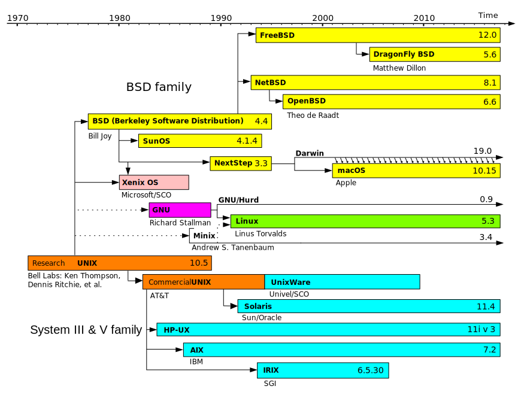
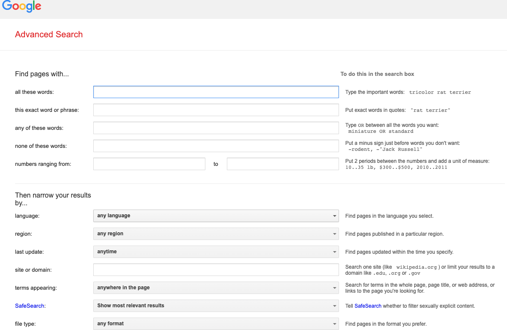
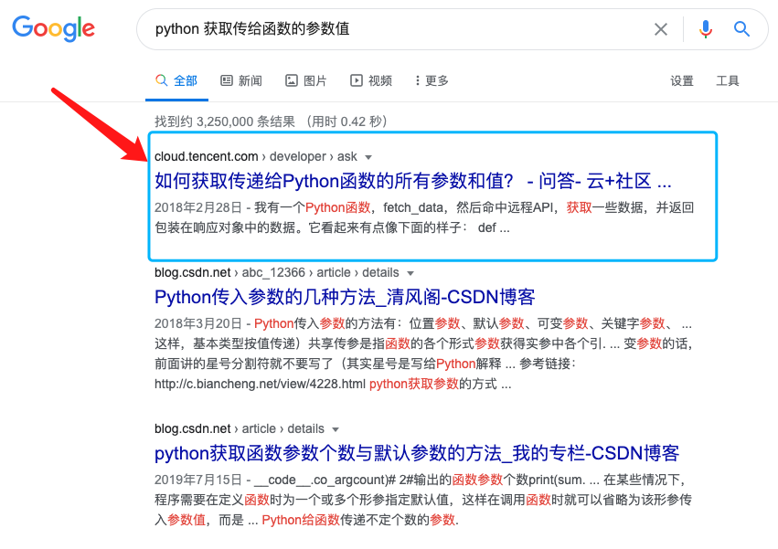
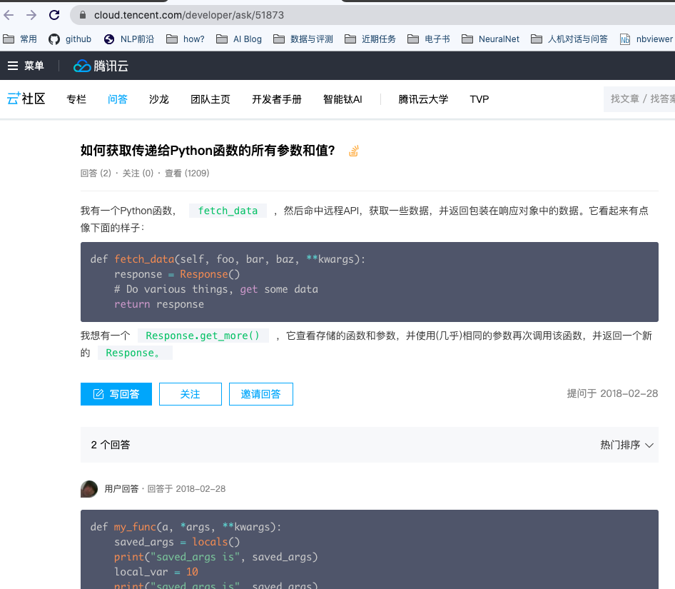
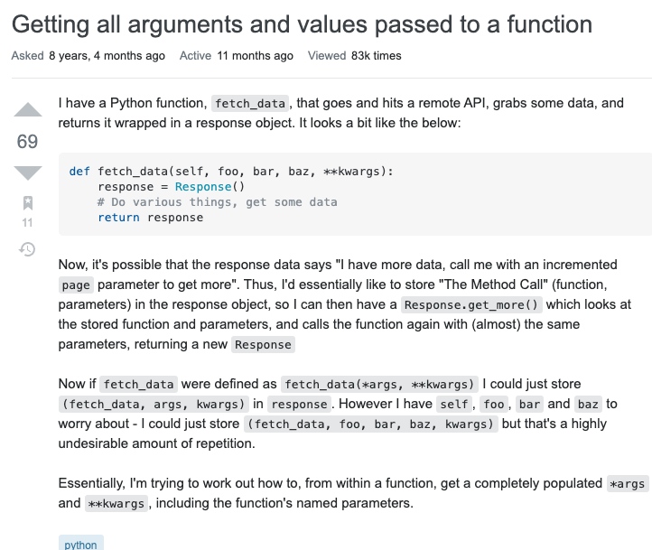
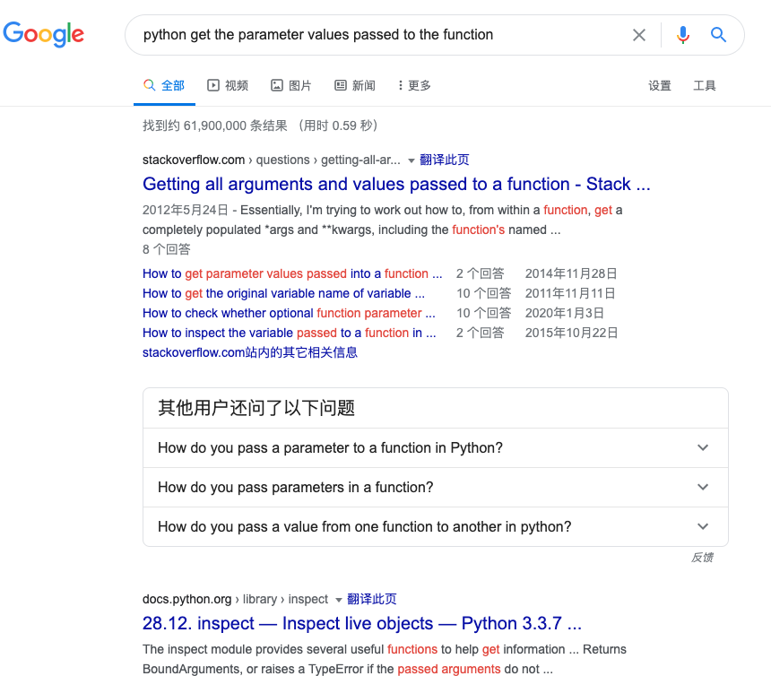

# Tutorials for 246 Freshmen

--北语 246 实验室新生指南  (Update:2020 年 9 月 22 号)

## 1. 编程能力

### 1.1 编程语言:
[index | TIOBE - The Software Quality Company](https://www.tiobe.com/tiobe-index/)

+ Shell(Bash,Zsh...)
+ Python 😘: 动态语言,学习难度低,上手快,分发简单,机器学习主要语言,执行速度感人
+ C++/C 🧐 : 学习难度太,支持范式复杂,分发困难,执行速度快,工业部署主要语言
+ Java : 学习难度一般, 应用场景多,执行速度快,工业部署主要语言,后端主要语言
+ Go
+ Scala
+ JavaScript/TypeScript
+ ~~prel/Lua/...~~

### 1.1.Extras

[Python 学习资源](https://github.com/LiangsLi/MyPublicNotes/blob/master/Python_Resources.md)

**Python 学习"路线图":**

1. 掌握基本的语法,学会使用函数处理问题,学习 pip 包管理
2. 学会使用 conda 管理虚拟环境, 学习Python面向对象,掌握多态,虚基类,重载等等
3. 了解 PEP8,掌握 Type Hints 并熟练使用,学会常见的 Pyhton 代码格式化和静态检查工具
4. 掌握 docker 和 wheel 包分发机制
5. 学习掌握 http 服务框架(flask,fastapi,...)
6. 了解常用的 CI/CD 工具
7. ......

**开发工具之争:**

`Pycharm` VS `VSCode` VS `vim`

`pycharm`依然是最强大的 Python IDE

**Python 项目常用静态工具:**

- PEP8格式化 [psf/black: The uncompromising Python code formatter](https://github.com/psf/black)
- 删除无用的import和变量 [myint/autoflake: Removes unused imports and unused variables as reported by pyflakes](https://github.com/myint/autoflake)
- [nedbat/coveragepy: Code coverage measurement for Python](https://github.com/nedbat/coveragepy)
- [PyCQA/bandit: Bandit is a tool designed to find common security issues in Python code.](https://github.com/PyCQA/bandit)
- [pyupio/safety: Safety checks your installed dependencies for known security vulnerabilities](https://github.com/pyupio/safety)
- [timothycrosley/isort: A Python utility / library to sort imports.](https://github.com/timothycrosley/isort)
- [pre-commit/pre-commit: A framework for managing and maintaining multi-language pre-commit hooks.](https://github.com/pre-commit/pre-commit)
- [pyupio/pyup: A tool to update your project's dependencies on GitHub. Runs on pyup.io, comes with a command line interface.](https://github.com/pyupio/pyup)

### 1.2 机器学习框架:

+ Pytorch 😀😀: 动态图,最流行,上手简单,调试简单
+ TensorFlow 1.x 😀: 静态图,工业界流行,上手略难,调试困难,API 变化大,基本不再开发维护
+ TensorFlow 2.x 😟: 动态图,API 变化极大,bug 较多,坑多
+ Sklearn : 传统机器学习算法
+ Keras/Chainer/MXNet/DL4J
+ PaddlePaddle/... :国内自研框架

### 1.3 Linux 系统日常使用和维护

+ 掌握常用命令/工具
+ shell 脚本的维护
+ 掌握包安装/编译安装
+ 程序执行/部署

**Refs:**

+ [Linux 资源管理常用命令](linux_resources_manage.md) 
+ [jaywcjlove/linux-command: Linux命令大全搜索工具](https://github.com/jaywcjlove/linux-command)
+ [37 Important Linux Commands You Should Know](https://www.howtogeek.com/412055/37-important-linux-commands-you-should-know/)
+ [图书:The Linux Command Line by William Shotts](http://linuxcommand.org/tlcl.php)

### 1.3.extra 使用 Linux 系统开发:

[Install Windows Subsystem for Linux (WSL) on Windows 10 | Microsoft Docs](https://docs.microsoft.com/en-us/windows/wsl/install-win10)

==**简明 Linux 发行版(distribution) 分类:**==

+ Debian 系
  + Debian GNU/Linux
  + Deepin
  + Ubuntu: 🌈
    + Linux Mint
    + Ubuntu Budget
+ Red Hat 系:
  + Red Hat Enterprise Linux
  + Fedora
  + CentOS
  + SUSE/openSUSE
+ ArchLinux
  + Manjaro
+ Alpine Linux

==**What is the difference between Unix, Linux, BSD and GNU?**==

## 2. 信息获取能力

+ 会议论文/预印论文/期刊论文/博士毕业论文(https://oatd.org/)
+ Google 学术/SCI-Hub
+ 技术博客/个人主页
+ Weibo/Twitter
+ 图书(https://libgen.lc/)
+ 各类学术活动/会议/组会
+ Github
+ 搜索引擎
+ 公众号/营销号

### 2.1 NLP 会议列表:

#### 2.1.1 国际会议:

+ ACL 🤩
+ EMNLP 🤩
+ NAACL 🤩
+ IJCAI
+ AAAI
+ SIGIR
+ COLING
+ LREC
+ EACL

更多会议列表和截止日期参见:

+ [AI Conference Deadlines](https://aideadlin.es/?sub=ML,NLP)
+ [NLP Calendar](https://www.cs.rochester.edu/nlp/nlpcalendar/)

#### 2.1.2 国内会议:

+ CCL
+ NLPCC
+ CLSW
+ ......

各类会议都会按照主题划分论文,有时候想把所有的论文全部看一遍是很困难的,应当优先关注自己感兴趣的领域.

### 2.2 一些优秀的技术博客/个人主页

####  2.2.1 企业/大学 AI Blog

+ [Google AI](https://ai.googleblog.com/)
+ [Facebook AI](https://ai.facebook.com/blog/?page=1)
+ [DeepMind AI](https://deepmind.com/blog)
+ [Microsoft AI](https://blogs.microsoft.com/ai/)
+ [AWS AI](https://aws.amazon.com/cn/blogs/machine-learning/)
+ http://ai.stanford.edu/blog/
+ http://nlp.seas.harvard.edu/

#### 2.2.2 一些学者主页

+ https://zhangmeishan.github.io/
+ http://www.ruiyan.me/
+ https://frcchang.github.io/index.html
+ https://ymcui.github.io/
+ http://ir.hit.edu.cn/~car/chinese.htm
+ http://nlp.csai.tsinghua.edu.cn/~lzy/
+ http://hlt.suda.edu.cn/~zhli/en.html
+ http://faculty.sist.shanghaitech.edu.cn/faculty/tukw/

#### 2.2.3 一些优质技术博客

+ https://kexue.fm/
+ http://www.paperweekly.site/
+ [Sebastian Ruder](http://ruder.io/) 
+ [Chris McCormick · Machine Learning Tutorials and Insights](https://mccormickml.com/)
+ https://medium.com/huggingface
+ https://medium.com/neuralmachine
+ https://medium.com/dair-ai
+ https://becominghuman.ai/
+ [Towards Data Science](https://towardsdatascience.com/?source=personalization_sidebar----7f60cf5620c9-----8-----------------------&gi=abea440ee0e6)

**几个推荐的博客平台:**

Medium, 知乎专栏, 博客网

**不推荐:** ~~CSDN,简书~~

#### 2.2.4 一些值得关注的公众号

+ AI研习社
+ 伯乐在线
+ DataFunTalk
+ GitHubDaily
+ 哈工大讯飞联合实验室
+ 哈工大SCIR
+ 机器之心
+ 平安寿险PAI
+ PaperWeekly
+ Python猫
+ 腾讯知文
+ TsinghuaNLP
+ 微软研究院AI头条
+ 夕小瑶的卖萌屋
+ 语言学午餐Ling-Lunch
+ 追一科技
+ 知识工场
+ 专知

### 2.3 学会翻墙

#### 2.3.1 Why

> Across the [Great Wall](https://zh.wikipedia.org/wiki/%E9%98%B2%E7%81%AB%E9%95%BF%E5%9F%8E), we can reach every corner in the world.

**Refs:**

+ [gfwlist/gfwlist: The one and only one gfwlist here](https://github.com/gfwlist/gfwlist)

#### 2.3.2 How

+ 使用付费 VPN APP (不推荐)
+ 购买 VPS 服务器,搭建 SS/SSR/V2Ray 服务(不推荐)
+ 购买 SSR"机场", 使用 Clash/Surge 连接

**Refs:**

+ [DuyaoSS-机场测速和简介 [SS/SSR/V2Ray] 【联通】更新中](http://387099.blogspot.com/2018/03/ssssr.html)

### 2.4 善用搜索引擎

#### 2.4.1 高级搜索:

常用的搜索引擎都支持**`高级搜索`**功能(包括但不限于 `站内搜索`,`文件搜索`,`反向搜索`...),可以通过相关语法或者进入高级搜索触发:

#### 2.4.2 英文描述问题

搜索引擎输入中文,搜索一个技术问题:

打开排名第一的结果,发现根本不是人话:

对比发现,这实际是直接机器翻译了 Stack Overflow 的问答:

如果直接使用英文搜索的话,会发现直接就能搜索到想要的答案:

**在搜索结果中屏蔽网站:**

+ [uBlacklist - Chrome 网上应用店](https://chrome.google.com/webstore/detail/ublacklist/pncfbmialoiaghdehhbnbhkkgmjanfhe)

## 3. 表达信息的能力

#### 3.1 书写"语言"

+ 学会 `markdown`/`rst` 等结构化文本标记语言
+ 养成记录笔记(在线博客/git pages/git notes/...)的习惯
+ 学会 `Latex` 并使用其撰写论文

**Refs:**

+ [Overleaf, Online LaTeX Editor](https://www.overleaf.com/)

#### 3.2 写你的第一篇论文

1. 确定题目
2. 确定数据
3. 确定模型算法
4. 实验
5. 论文撰写与修改
6. 投稿

建议第一篇论文投稿 CLSW/CCL/NLPCC/...等国内会议

## 4. 协同工作的能力

#### 4.1 掌握 git

+ 掌握 git 的基本命令
+ 持续学习 git 的功能
+ 使用 github 管理自己的代码
+ 尝试参与到 github 的开源项目中,体验协同开发

**Refs:**

+ [How_to_contribute · opencv/opencv Wiki](https://github.com/opencv/opencv/wiki/How_to_contribute)
+ [flask/CONTRIBUTING.rst at master · pallets/flask](https://github.com/pallets/flask/blob/master/CONTRIBUTING.rst)
+ [Learn Git Branching](https://learngitbranching.js.org/?locale=zh_CN)
+ [Git](https://git-scm.com/)

#### 4.2 沟通的能力

+ 结构化描述与表达
+ email 的使用

## 5. NLP 研究入门

首先了解 NLP 的细分领域和前沿进展: [Tracking Progress in Natural Language Processing | NLP-progress](https://nlpprogress.com/) ;

然后可以按照自己感兴趣的方向检索相关资源, 进一步学习和了解.

**一些 FAQ:**

- [国内有哪些自然语言处理的牛人或团队？ - 知乎](https://www.zhihu.com/question/24366306)
- [初学者如何查阅自然语言处理学术资料（2016修订版)](https://zhuanlan.zhihu.com/p/23636267)
- [如何不出国门走进NLP学术前沿 - 知乎](https://zhuanlan.zhihu.com/p/35380020)
- [如何写一篇合格的NLP论文 - 知乎](https://zhuanlan.zhihu.com/p/58752815)
- [NLP入门推荐书目（2019版） - 知乎](https://zhuanlan.zhihu.com/p/58874484)
- [写给正在填报志愿并对CS/AI感兴趣的考生们-2019 - 知乎](https://zhuanlan.zhihu.com/p/68474477)
- [How is computational linguistics different from natural language processing? - Quora](https://www.quora.com/How-is-computational-linguistics-different-from-natural-language-processing)
- [nlp - What are the fundamental differences between Natural Language Processing and Computational Linguistics? - Linguistics Stack Exchange](https://linguistics.stackexchange.com/questions/1802/what-are-the-fundamental-differences-between-natural-language-processing-and-com)
- [What's the difference between machine learning, AI, and NLP? - Quora](https://www.quora.com/Whats-the-difference-between-machine-learning-AI-and-NLP)

**一些优质图书:**

+ **Natural Language Processing** by Jacob Eisenstein 

  ★★★★★【电子书】这是Jacob Eisenstein(https://jacobeisenstein.github.io/)教授NLP课程(https://github.com/jacobeisenstein/gt-nlp-class)的教科书，内容质量很好，而且在不断更新。本书为开源图书，

+ **Speech and Language Processing 3E** by Daniel Jurafsky

  ★★★★★【电子书】本书为斯坦福大学大牛编写的图书，目前已经更新到第三版（仍在编写修改），需要注意很多在线下载的本书都是第二版，本书的质量也非常高。本书在线[免费更新下载](https://web.stanford.edu/~jurafsky/slp3/)

+  **Deep Learning inNatural Language Processing** by 邓力

  ★★★【电子书】本书是2017年邓力和刘洋召集一些前沿学者（主要是中国人）编写的一个NLP图书，每章都是由该领域的学者编写，所以质量也很高，不过本书编写于2017年，最近两年的新成果没有包含进去，不过仍值得一看。[地址](https://drive.google.com/file/d/1ySSs3OW4otDA8uzfXb3YAOqHr2RKKRb_/view?usp=sharing)（需要翻墙）

+  **神经网络与深度学习** by 邱锡鹏

  ★★★★★【电子书】[地址](https://nndl.github.io/)

+  **神经网络与深度学习** by Michael Nielsen (哈工大译)

  ★★★★★【电子书】[地址](https://hit-scir.gitbooks.io/neural-networks-and-deep-learning-zh_cn/content/)

+  **基于深度学习的自然语言处理** by Yoav Goldberg （车万翔译）

  ★★★★【实体书】

+ **统计自然语言处理** by 宗成庆

  ★★★【实体书】

+  **统计机器学习**（第二版）by 李航

  ★★★【实体书】

+  **机器学习**（西瓜书）by 周志华

  ★★★【实体书】

+  **深度学习**（花书）by Ian Goodfellow and Yoshua Bengio and Aaron Courville

  ★★★【实体书/电子书】[地址](https://www.deeplearningbook.org/)

**一些课程:**

> 建议直接去 bilibili 搜索关键词, eg: 机器学习, 深度学习, 李宏毅, 林轩田,吴恩达

**一些值得细读的Python项目:**

+ [scikit-learn/scikit-learn: scikit-learn: machine learning in Python](https://github.com/scikit-learn/scikit-learn)
+ [huggingface/transformers: 🤗Transformers: State-of-the-art Natural Language Processing for Pytorch and TensorFlow 2.0.](https://github.com/huggingface/transformers)
+ [pytorch/fairseq: Facebook AI Research Sequence-to-Sequence Toolkit written in Python.](https://github.com/pytorch/fairseq)

## 6.职业规划

### 6.1 求职方向:

+ NLP 算法工程师
+ NLP 算法研究员
+ 其他算法工程师
+ 开发
+ 产品经理
+ 其他非技术行业

### 6.2 建议

+ 早刷题, 早看笔试面试经验
+ 早实习, 争取大厂实习机会,正确实习转正机会
+ 能内推就内推, 能提前批就提前批
+ 换行要乘早

